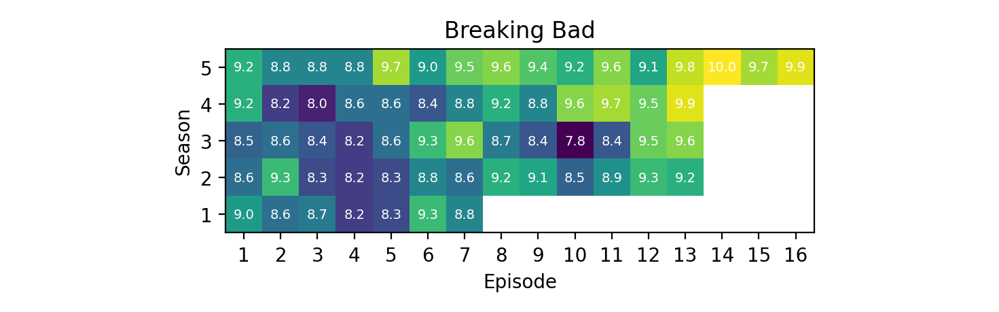

# IMDB Series Rating Scraper

## Introduction

This tool scrapes the website https://www.imdb.com for ratings of individual episodes of a series.
A csv file is generated to cache the ratings.
Using matplotlib, the tool then generates a heatmap representation of all episodes in the series.

## Examples

### Data output

The following table shows transposed data for the series "Breaking Bad" which is generated by the scraper and saved to the csv file under `data/Breaking Bad.csv`.

| season  | 1   | 1   | 1   | 1   | 1   | 1   | 1   | 2   | 2   | 2   | 2   | 2   | 2   | 2   | 2   | 2   | 2   | 2   | 2   | 2   | 3   | 3   | 3   | 3   | 3   | 3   | 3   | 3   | 3   | 3   | 3   | 3   | 3   | 4   | 4   | 4   | 4   | 4   | 4   | 4   | 4   | 4   | 4   | 4   | 4   | 4   | 5   | 5   | 5   | 5   | 5   | 5   | 5   | 5   | 5   | 5   | 5   | 5   | 5   | 5    | 5   | 5   |
|---------|-----|-----|-----|-----|-----|-----|-----|-----|-----|-----|-----|-----|-----|-----|-----|-----|-----|-----|-----|-----|-----|-----|-----|-----|-----|-----|-----|-----|-----|-----|-----|-----|-----|-----|-----|-----|-----|-----|-----|-----|-----|-----|-----|-----|-----|-----|-----|-----|-----|-----|-----|-----|-----|-----|-----|-----|-----|-----|-----|------|-----|-----|
| episode | 1   | 2   | 3   | 4   | 5   | 6   | 7   | 1   | 2   | 3   | 4   | 5   | 6   | 7   | 8   | 9   | 10  | 11  | 12  | 13  | 1   | 2   | 3   | 4   | 5   | 6   | 7   | 8   | 9   | 10  | 11  | 12  | 13  | 1   | 2   | 3   | 4   | 5   | 6   | 7   | 8   | 9   | 10  | 11  | 12  | 13  | 1   | 2   | 3   | 4   | 5   | 6   | 7   | 8   | 9   | 10  | 11  | 12  | 13  | 14   | 15  | 16  |
| rating  | 9.0 | 8.6 | 8.7 | 8.2 | 8.3 | 9.3 | 8.8 | 8.6 | 9.3 | 8.3 | 8.2 | 8.3 | 8.8 | 8.6 | 9.2 | 9.1 | 8.5 | 8.9 | 9.3 | 9.2 | 8.5 | 8.6 | 8.4 | 8.2 | 8.6 | 9.3 | 9.6 | 8.7 | 8.4 | 7.8 | 8.4 | 9.5 | 9.6 | 9.2 | 8.2 | 8.0 | 8.6 | 8.6 | 8.4 | 8.8 | 9.2 | 8.8 | 9.6 | 9.7 | 9.5 | 9.9 | 9.2 | 8.8 | 8.8 | 8.8 | 9.7 | 9.0 | 9.5 | 9.6 | 9.4 | 9.2 | 9.6 | 9.1 | 9.8 | 10.0 | 9.7 | 9.9 |

### Heatmap output

The following image shows an example of the heatmap that can be generated from the above table data. 
The heatmap in this example saved to `heatmaps/Breaking Bad.png`. 

## Quickstart

### Prerequisites

- Python version `Python 3.9.13`
- Python packages see `requirements.txt`

### Setup

#### Scraper

1. Run `python scrape.py` to scrape the IMDB website for a specific series.
2. Run `python heatmap.py` to create a plot for the scraped series.

