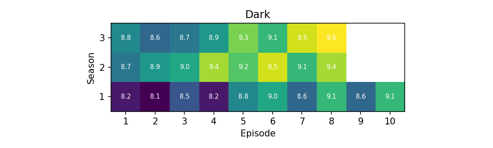
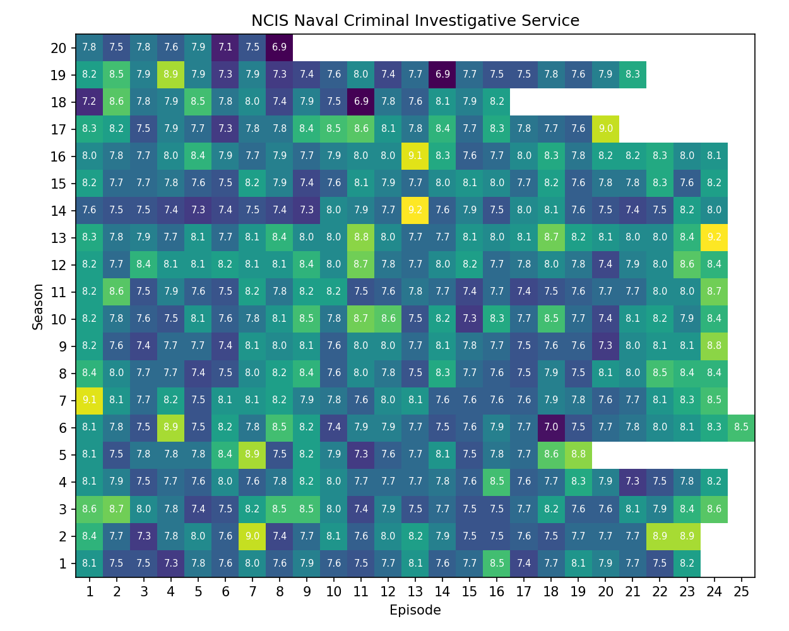

# IMDB Series Rating Scraper

## Introduction

This tool scrapes the website https://www.imdb.com for ratings of individual episodes of a series.
A csv file is generated to cache the ratings.
Using matplotlib, the tool then generates a heatmap representation of all episodes in the series.
Because this tools relies on scraping the html tree of the imdb page, it might break anytime. 
Feel free to message me if the scraper doesn't work anymore or create a pull request with adjusted xpaths.

|   |    |
|---------|-----|
|  |  |

## Examples

### Data output

The following table shows data that is generated by the scraper for the first season of **Breaking Bad**.
For the full data output see `examples/data/Breaking Bad.csv`.

| season | episode | name                          | rating |
|--------|---------|-------------------------------|--------|
| 1      | 1       | Pilot                         | 9.0    |
| 1      | 2       | Cat's in the Bag...           | 8.6    |
| 1      | 3       | ...And the Bag's in the River | 8.7    |
| 1      | 4       | Cancer Man                    | 8.2    |
| 1      | 5       | Gray Matter                   | 8.3    |
| 1      | 6       | Crazy Handful of Nothin'      | 9.3    |
| 1      | 7       | A No-Rough-Stuff-Type Deal    | 8.8    |

### Heatmap output

The following image shows an example of the heatmap that can be generated.
Heatmaps of some example series can be found under `examples/img/`. 


## Quickstart

### Dependencies

- Python version `Python 3.9.13`
- Python packages see `requirements.txt`

### Setup

1. Clone this repository

| **HTTPS**  | `$ git clone https://github.com/trflorian/imdb-scraper-heatmap.git` |
| ---|---|
| **SSH** |`$ git clone git@github.com:trflorian/imdb-scraper-heatmap.git` |

3. (Optional) Create a virtual environment for this project 
4. Install the required python packages in your python environment.

`$ python -m pip install -r requirements.txt`

5. Run `$ python scraper.py` to scrape the IMDB website for a specific series.
6. Run `$ python heatmap.py` to create a plot for the scraped series.

### Usage

``` 
$ python .\examples\heatmap.py --help

usage: heatmap.py [-h] [-s] [-d] [-o] [-n NAME]

optional arguments:
  -h, --help            show this help message and exit
  -s, --show            show the heatmap plot instead of saving it
  -d, --dark            use dark mode for the plot style
  -o, --override        override existing plots, only used if show flag is not set
  -n NAME, --name NAME  name of the series, if not set the whole data directory will be scanned
```

